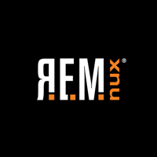

# REMnux: A Linux Toolkit for Malware Analysts



This site provides official documentation for [REMnux](https://REMnux.org/)®, a Linux toolkit for reverse-engineering or otherwise examining malicious software. The toolkit provides a curated collection of free tools created by the community. Malware analysts can start exploring malware without having to find, install, and configure the tools.


This documentation applies to version 7 of the REMnux distro, which is curently in limited beta and will be released shortly. For details about version 6, see the [v6 documentation site](https://REMnux.org/docs).


## Install the REMnux Distro

The heart of the toolkit is the REMnux Linux distribution based on Ubuntu 18.04. It incorporates many tools for analyzing malicious:

* Executables and binaries
* Scripts, including JavaScript
* Documents, including Microsoft Office and PDF files
* Network interactions, such as C2 communications

You can [download the REMnux distro as a pre-built virtual appliance](install-distro/get-virtual-appliance.md), [install it from scratch on a dedicated system](install-distro/install-from-scratch.md), or [add it to an existing machine](install-distro/add-to-existing-system.md).

## Keep REMnux Up to Date

Keep your REMnux system up to date by running the following command once in a while, so you benefit from the latest enhancements:

```text
sudo remnux upgrade
```

If you're running the REMnux distro in a virtual machine, consider taking a snapshot before upgrading, so you can revert to a good state in case something goes wrong.

## Run Tools in Containers <a id="run-in-containers"></a>

The REMnux toolkit also offers [Docker images of popular malware analysis tools](run-tools-in-containers/remnux-containers.md), making it possible to run the applications as containers without having to install them directly on the system.

## Get Involved with the Project

You can participate in the REMnux project by:

* [Asking and answering questions](get-involved/ask-and-answer-questions.md) related to the distro and its tools
* [Adding or updating tools](get-involved/add-or-update-tools/) that comprise the distribution
* [Creating articles, blog posts, and videos](get-involved/write-about-the-tools.md) about the tools on REMnux

## Learn More About REMnux

You can learn about the [people](behind-the-scenes/people.md) and [technologies](behind-the-scenes/technologies/) that make REMnux possible.

For articles and videos about using the tools that REMnux provides, see the [tips section of this site](elsewhere/tips-about-remnux-tools.md).

