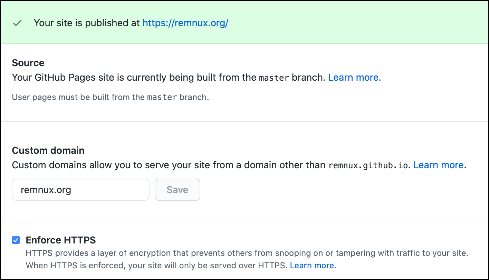

# Website and Docs

Several technologies work together generate and host the REMnux website and this documentation. Thank you to the people and companies behind these technologies for providing them as free resources to help make REMnux possible!

## The REMnux Website

The REMnux website, accessible at [https://REMnux.org](https://REMnux.org), is a set of static pages and related asset files. It's hosted on GitHub using [GitHub Pages](https://pages.github.com). These contents reside in the [remnux/remnux.github.io](https://github.com/REMnux/remnux.github.io) repository, which is configured to use Github Pages like this:

The contents of that repository are generated using [Hugo](https://gohugo.io), based on the source files that reside in the [remnux/website-source](https://github.com/REMnux/website-source) repository on GitHub. Updating the REMnux website involves:

* Adjusting these files to reflect the desired change
* Using Hugo to generate the static website content
* Placing the new content in the remnux/remnux.github.io repository

The website contents are formatted using a customized version of the [Raditian Free Hugo Theme](https://github.com/radity/raditian-free-hugo-theme), which was created by [Radity](https://radity.com).

## The REMnux Documentation Site 

The REMnux documentation site, which you're reading now and which resides at [https://docs.remnux.org](https://docs.remnux.org), is generated and hosted by [GitBook](https://www.gitbook.com). GitBook is configured to back up documentation contents to the [remnux/docs](https://github.com/REMnux/docs) repository on GitHub.

The listing of REMnux tools, available as part of REMnux documentation, is generated automatically using the [header-parser.py script](https://github.com/REMnux/salt-states/blob/master/.ci/header-parser.py), which was written by [Halil Burak Noyan](https://twitter.com/hbnoyan). The script parses the headers of [SaltStack state files](saltstack-management.md), which comprise the REMnux distro, and updates the tool listing using [GitBook API](https://developer.gitbook.com).

